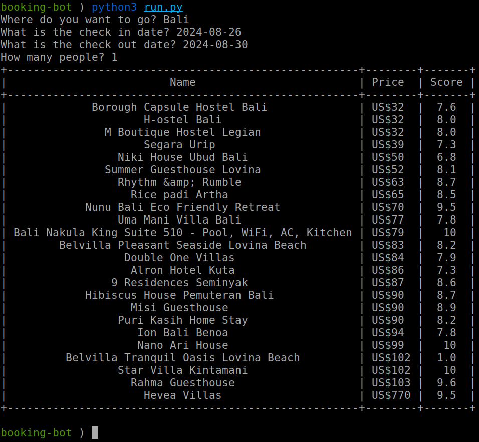

<p align='center'>
  
</p>

# Booking Bot using Selenium

A Python script to interact with [Booking.com](https://www.booking.com/) and generate a report of search results using [Selenium](https://www.selenium.dev/).

## Description
This script uses the Booking class to navigate Booking.com, select search options, and generate a report of the search results. The script allows users to input their search options, such as destination, check-in and check-out dates, and number of adults. It then searches for available hotels, applies filtrations to the search results, and generates a report of the top results.

## Getting Started
```bash
git clone https://github.com/hassan-arif/booking-bot.git
cd booking-bot
pip install -r requirements.txt
```

## Usage
To run the script, simply execute the `main.py` file:

```bash
python3 main.py
```

The script will prompt you to input your search options, and then generate a report of the top results.

## Features
* Interact with Booking.com to search for available hotels
* Allow users to input their search options, such as destination, check-in and check-out dates, and number of adults
* Apply filtrations to the search results, such as price and star rating
* Generate a report of the top results, including hotel name, price, and score

## Screenshot
Below is a sample output of the script, showcasing the formatted list of search results using PrettyTable:
<p align='center'>
  
</p>

## Contributing
Contributions are welcome! If you'd like to contribute to this project, please fork the repository and submit a pull request.

Feel free to customize it as per your needs!

## References

* [Selenium Course](https://youtu.be/j7VZsCCnptM?si=sP5gN0tepnpp4N7s)
* [jimdevops19/SeleniumSeries](https://github.com/jimdevops19/SeleniumSeries)